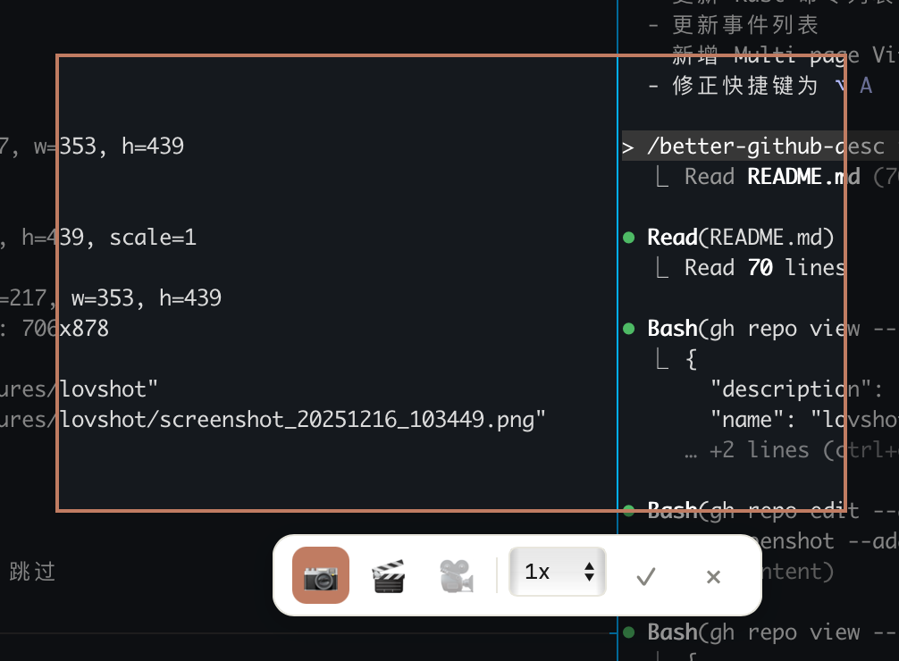

# Lovshot

轻量级屏幕截图和 GIF 录制工具，专为 macOS 设计。

## 功能

- **区域截图** - 框选任意区域，一键保存到剪贴板和本地
- **GIF 录制** - 录制屏幕区域，内置编辑器裁剪和调整参数
- **全局快捷键** - `⌥ A` 随时唤起，无需切换窗口
- **菜单栏常驻** - 不占用 Dock 和 Cmd+Tab，安静运行

## 截图

| 选择界面 | GIF 导出界面 |
|:---:|:---:|
|  |  |

## 安装

### 从源码构建

```bash
# 克隆项目
git clone https://github.com/user/lovshot.git
cd lovshot

# 安装依赖
pnpm install

# 开发模式
pnpm tauri dev

# 构建
pnpm tauri build
```

## 使用

1. 按 `⌥ A` 打开选择器
2. 拖拽选择区域
3. 选择模式：📷 截图 或 🎬 GIF
4. 点击 ✓ 确认

### GIF 编辑器

录制完成后自动进入编辑器：

- **时间线裁剪** - 拖动手柄选择导出范围
- **分辨率调整** - 支持原始/1080p/720p/480p 等预设
- **帧率控制** - 5-30 fps 可选
- **循环模式** - 无限循环/单次/来回

## 快捷键

| 快捷键 | 功能 |
|--------|------|
| `⌥ A` | 打开选择器 / 停止录制 |
| `ESC` | 取消选择 |
| `Enter` | 确认选择 |
| `S` | 切换到截图模式 |
| `G` | 切换到 GIF 模式 |

## 技术栈

- [Tauri 2](https://v2.tauri.app/) + Rust
- React 19 + TypeScript
- Vite

## License

MIT
